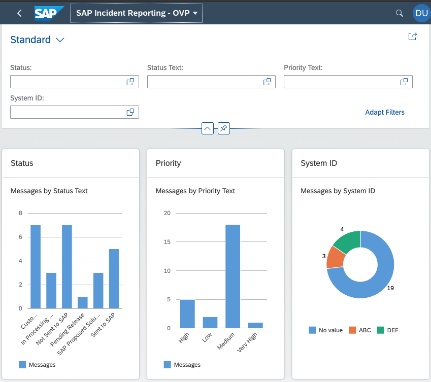
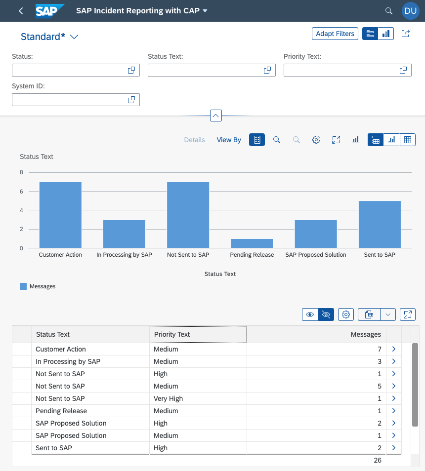

# SAP Support Message Reporting

Replicate data from SAP Support Launchpad Incident OData service for local reporting.
## Current functionality

Currently two visualizations are implemented. An Overview Page:



and an Analytical List Page:



## TODO

- [x] Load data from mock
- [x] Load data SAP Service Marketplace
- [x] Docker Image
- [ ] Add reporting for the event log (MessageAlogSet)
- [ ] Find a user friendly way to maintain the Authentication Cookie
- [ ] Deploy to SAP HANA Cloud & SAP BTP Cloud Foundry
- [ ] Expose Data to SAP Analytics Cloud
- [ ] Implement further reports in SAP Analytics Cloud

## Run from Docker image

First time start:

`docker run --name sap-support-message-reporting -i -p 4004:4004 gregorwolf/sap-support-message-reporting:latest`

[Load Data from Mock Service](#load-data-from-mock-service)

Then open http://localhost:4004 in the browser.

Stop:

`docker stop sap-support-message-reporting`

Start:

`docker start -i sap-support-message-reporting`

Remove:

`docker rm sap-support-message-reporting`

## Update Mock Data with your own Incidents

If you want to update the mock date in the srv/data folder with your own SAP Incidents, then open your Browser, activate the Development tools, switch to the network tab and then open the URL:

https://launchpad.support.sap.com/services/odata/incidentws/?$format=json

You need to login with your SAP User. Open the details of the request and look for the Request Headers:


You find the Cookies. Copy the content of the Cookies header and add it's content to a file named .env in the test folder. The Content should look like that:

```
cookie=JTENANTSESSIONID_supportportal....
```

When you've done that make sure that you've opened this project in VS Code and the [REST Client](https://marketplace.visualstudio.com/items?itemName=humao.rest-client) is installed. Open the test/get-data-from-sap.http file and execute the first two requests. With the result you can fill the corresponding files in the srv/data folder. To protect the privacy only specific columns are selected. If you comment the lines starting with *&$select=* with a # you will get all data.

## Load Data from Mock Service

To load data from the mock service into sqlite please create a *default-env.json* file in the root folder with the following content:

```JSON
{
  "destinations": [
    {
      "destination": "OSS",
      "url": "http://localhost:4004"
    }
  ]
}
```

then start the project with `npm start` and execute the *loadDataFromMock* request in the *test/cap-endpoint.http* file.

## Load Data from SAP Service Marketplace

To load data from OSS add the following section to the *default-env.json* file in the root folder:

```JSON
  ,
  "OSS_COOKIE": {
    "cookie": "<Your Cookie>"
  }
```

replace `<Your Cookie>` with the content of [your cookie that you've got from your browser](#update-mock-data-with-your-own-incidents). Then start the project with `npm start` and execute the *loadDataFromSAP* request in the *test/cap-endpoint.http* file.