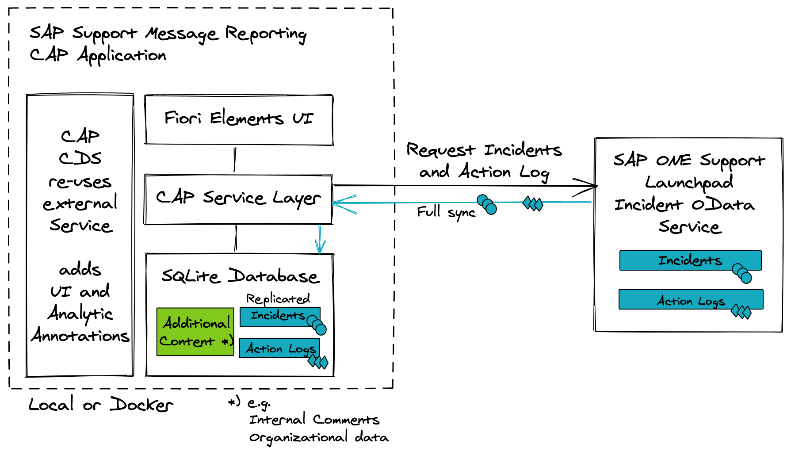

# SAP Support Message Reporting

Replicate data from SAP Support Launchpad Incident OData service for local reporting.
## Architecture



## Current functionality

Currently two visualizations are implemented. An Overview Page:


and an Analytical List Page:


## TODO

- [x] Load data from mock
- [x] Load data SAP Service Marketplace
- [x] Docker Image
- [ ] Add reporting for the event log (MessageAlogSet)
- [ ] Find a user friendly way to maintain the Authentication Cookie. Using the SAP Passport (X.509 Client Certificate) would be a good option. Here [using SSL Certificate with Axios](https://stackoverflow.com/questions/51363855/how-to-configure-axios-to-use-ssl-certificate) might help.
- [ ] Deploy to SAP HANA Cloud & SAP BTP Cloud Foundry
- [ ] Expose Data to SAP Analytics Cloud
- [ ] Implement further reports in SAP Analytics Cloud

## Run from Docker image

First time start:

`docker run --name sap-support-message-reporting -i -p 4004:4004 gregorwolf/sap-support-message-reporting:latest`

[Load Data from Mock Service](#load-data-from-mock-service)

Then open http://localhost:4004 in the browser.

Stop:

`docker stop sap-support-message-reporting`

Start:

`docker start -i sap-support-message-reporting`

Remove:

`docker rm sap-support-message-reporting`

## Update Mock Data with your own Incidents

If you want to update the mock date in the srv/data folder with your own SAP Incidents, then open your Browser, activate the Development tools, switch to the network tab and then open the URL:

https://launchpad.support.sap.com/services/odata/incidentws/?$format=json

You need to login with your SAP User. Open the details of the request and look for the Request Headers:


You find the Cookies. Copy the content of the Cookies header and add it's content to a file named .env in the test folder. The Content should look like that:

```
cookie=JTENANTSESSIONID_supportportal....
```

When you've done that make sure that you've opened this project in VS Code and the [REST Client](https://marketplace.visualstudio.com/items?itemName=humao.rest-client) is installed. Open the test/get-data-from-sap.http file and execute the first two requests. With the result you can fill the corresponding files in the srv/data folder. To protect the privacy only specific columns are selected. If you comment the lines starting with *&$select=* with a # you will get all data.

## Load Data from Mock Service

To load data from the mock service into sqlite please create a *default-env.json* file in the root folder with the following content:

```JSON
{
  "destinations": [
    {
      "destination": "OSS",
      "url": "http://localhost:4004"
    }
  ]
}
```

then start the project with `npm start` and execute the *loadDataFromMock* request in the *test/cap-endpoint.http* file.

## Load Data from SAP Service Marketplace

To load data from OSS add the following content to the *default-env.json* file in the root folder:

```JSON
{
  "VCAP_SERVICES": {},
  "destinations": [
    {
      "destination": "OSS",
      "url": "https://launchpad.support.sap.com",
      "credentials": {}
    }
  ],
  "OSS_COOKIE": {
    "cookie": "<Your Cookie>"
  }
}
```

you can now replace `<Your Cookie>` with the content of [your cookie that you've got from your browser](#update-mock-data-with-your-own-incidents). The other option is to use the SAP Passport (X.509 Client Certificate). At https://launchpad.support.sap.com/#/sappassport all S-Users can get their SAP Passport and install it into their local certificate store to Single Sign On (SSO) to the SAP Service Marketplace. [With this steps](https://www.ibm.com/support/knowledgecenter/SSVP8U_9.7.0/com.ibm.drlive.doc/topics/r_extratsslcert.html) the resulting PFX file can be prepared to be used with curl and NodeJS:

```
openssl pkcs12 -in s-user.pfx -nocerts -out s-user.key
openssl pkcs12 -in s-user.pfx -clcerts -nokeys -out s-user.crt
openssl rsa -in s-user.key -out s-user-decrypted.key
```

Then run `npm run update:cookie` to update the cookie in *default-env.json*.

Then start the project with `npm start` and execute the *loadDataFromSAP* request in the *test/cap-endpoint.http* file.

## Deploy to Kyma

Download the kubeconfig from your Kyma instance via the menu behind the account Icon in the upper right corner. Save it in *~/.kube/kubeconfig-kyma.yml*. Then run:

`export KUBECONFIG=~/.kube/kubeconfig-kyma.yml`

Please note that the token in the kubeconfig is [only valid for 8 hours](https://kyma-project.io/docs/components/security#details-iam-kubeconfig-service). So you might have to redo the download whenever you want to run the commands again.

To keep this project separate from your other deployments I would suggest to create a namespace:

`kubectl create namespace sap-support-message-reporting`

Deploy the configuration:

`kubectl -n sap-support-message-reporting apply -f kyma/deployment.yaml`

Update the container:

`kubectl -n sap-support-message-reporting rollout restart deployment/sap-support-message-reporting`